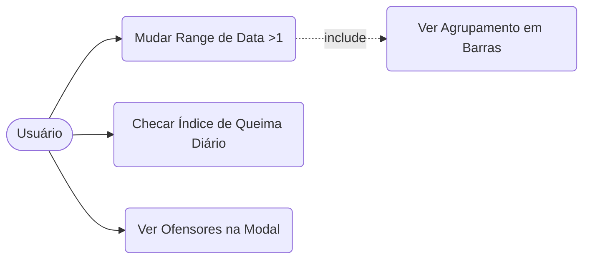
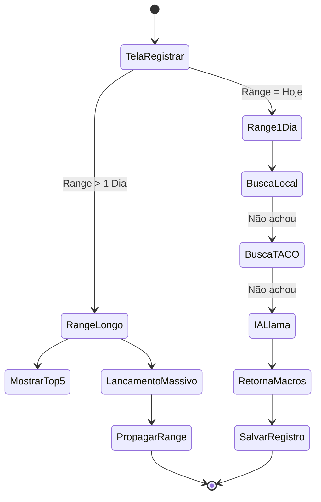
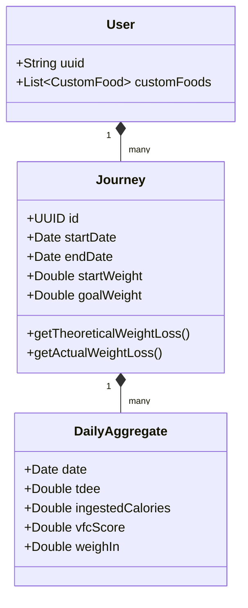
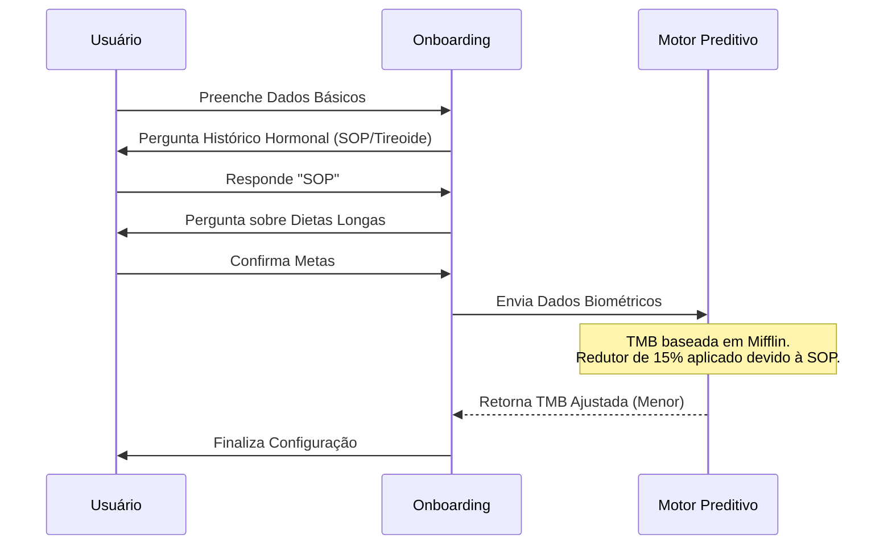

# Documento Funcional e Técnico do Sistema: How2Burn

**Versão Documento:** 1.6 (Correção de Sintaxe UML / Mermaid)
**Objetivo:** Detalhar de forma abrangente e ultradetalhada os requisitos funcionais, não funcionais, regras de negócio, memórias de cálculo, e fluxos do ecossistema How2Burn (iOS, WatchOS, Widgets e Motores de Inteligência), utilizando modelagem UML nativa (via diagramas de fluxo, classe, estado e sequência).

---

## 1. Visão Geral do Sistema (Macro Funcionalidades)
O **How2Burn** é um motor cognitivo de emagrecimento que orquestra balanço energético, qualidade metabólica e comportamental em múltiplos pontos de contato.
1. **Painel Dinâmico (Dashboard):** Visão em tempo real de Déficit, Macros, Índices de Saúde (Fat Loss Score), Alertas Biológicos e Agrupamentos Temporais.
2. **Registrar (Log Multimodal):** Inserção via Texto, Vision (Gemini), NLP (Llama), TACO, Histórico do Usuário e Lançamentos Massivos.
3. **Dr. Chama (Coach de IA):** A persona virtual que cruza dados para fornecer *insights* prescritivos.
4. **Jornadas (Journeys):** Parametrização customizada de recortes temporais para alinhar teoria calórica com o peso real.
5. **Ecossistema Apple (Watch & Widgets):** Espelhamento rápido do metabolismo nas telas iniciais do iPhone e no Apple Watch.
6. **Configurações & Perfil:** Ajustes de motor preditivo endócrino e permissões.

---

## 2. Requisitos Não Funcionais (RNFs)

- **RNF001 - Integração com HealthKit:** Extrair bidirecionalmente Passos, Sono, VFC, Atividades e Peso em segundo plano.
- **RNF002 - Privacidade e LLMs:** Consultas a LLMs (Gemini, Llama) devem trafegar *apenas* dados alimentares, mascarando o ID do usuário.
- **RNF003 - Performance Analítica:** Agrupamentos gráficos com "Range > 1" (semanal/mensal) devem calcular em menos de 500ms via CoreData.
- **RNF004 - UI/UX Haptic Feedback:** Atingir limites, alertas ou confirmações disparam respostas CoreHaptics.
- **RNF005 - Persistência Offline e Sincronização:** Suporte offline-first, exceto requisições diretas de IA. Widgets usam Timeline Providers em background.

---

## 3. Macro Funcionalidade 1: Painel Dinâmico (Dashboard)
*(Ref Visual: Telas/1.6.4/Painel/Painel_01.png até Painel_19.png)*

### 3.1. Agrupamento em Ranges de Data (> 1 Dia)
Ao selecionar um período largo (ex: 7 dias):
- O dashboard agrega dados e o gráfico circular transmuta para um **gráfico de barras agregadas**.
- Clicar numa barra exibe um **Tooltip** dinâmico cruzando consumo com a VFC exata daquele dia. *(Ref: Painel_04.png, Painel_10.png)*

### 3.2. Análise de Substâncias Críticas (Açúcar e Colesterol)
- O card acusa alta de Açúcar/Colesterol. *(Ref: Painel_05.png)*
- **Ao clicar:** Abre-se Modal com detalhes técnicos. Logo abaixo, a modal **agrupa os ofensores**, listando ordenadamente os alimentos consumidos hoje que provocaram o alerta. *(Ref: Painel_11.png, Painel_12.png)*

### 3.3. Casos de Uso (UML Flowchart) e Memória de Cálculo

- **Gasto Energético Diário Total (TDEE):** `TDEE = TMB + NEAT + EAT` (Mifflin-St Jeor + Ajustes Dinâmicos).
- **Índice de Queima (Fat Loss Readiness):** Pontuação (0-100) baseada em Sono (30%), VFC Média (40%) e Passos (30%).

---

## 4. Macro Funcionalidade 2: Dr. Chama (Inteligência & Coaching)

### 4.1. Visão Geral e Fluxo
**Dr. Chama** atua como o tutor metabólico do app com contexto ativo de saúde.
1. O usuário aciona o Dr. Chama no app.
2. O sistema injeta o contexto biológico no *Prompt* (Ex: "VFC 30ms, sono ruim, déficit alto").
3. Dr. Chama retorna um **feedback prescritivo**: "Sua VFC caiu. Foque em hidratação e evite déficit alto hoje para proteger massa magra."

---

## 5. Macro Funcionalidade 3: Registrar e Motores de Busca
*(Ref Visual: Telas/1.6.4/Registrar/Registrar_01.png até Registrar_09.png)*

### 5.1. Arquitetura de Fallbacks e IA
1. **Histórico Local:** Busca em cache ultra-rápida. *(Ref: Registrar_05.png)*
2. **Base TACO:** Tabela Nacional de Alimentos auditada (Unicamp).
3. **IA Llama:** Vasculha portais globais (USDA, FatSecret) e retorna JSON formatado.
4. **Gemini:** Extração por Foto ou Áudio. *(Ref: Registrar_04.png)*

### 5.2. Tela de Registros em Range Expandido (> 1 Dia)
- **Top 5 Ofensores:** Mostra um placar com as 5 "Famílias de Alimentos" que mais trouxeram calorias no período longo.
- **Lançamento Massivo:** Selecionar um alimento permite marcar "Para todos os dias no range", disparando inserções em lote no banco de dados. *(Ref: Registrar_02.png)*

### 5.3. Diagrama de Atividades (Busca e Lançamento Massivo)

---

## 6. Macro Funcionalidade 4: Extensões do Ecossistema (Watch & Widgets)

### 6.1. Widgets do iOS (Home Screen e Lock Screen)
- **Home Screen Widgets:** Exibem o "Ring" de Déficit, Macros e Índice de Queima via atualizações de Timeline.
- **Lock Screen Widgets:** Complicações radiais do iPhone diretamente na tela bloqueada.

### 6.2. Apple Watch App (WatchOS)
- **Painel no Pulso:** Ring Diário e barras de Macro autônomas.
- **Log Rápido (Quick Log):** Botões para ditar via Siri ("Comi um pão de queijo").
- **Complicações (Watch Faces):** Ícones nos cantos do mostrador indicando o status do déficit em tempo real, com *background refreshes*.

---

## 7. Macro Funcionalidade 5: Jornadas e Saúde Preventiva
*(Ref Visual: Telas/1.6.4/Jornadas/Jornadas_01.png até Jornadas_04.png)*

### 7.1. Fluxo de Criação de Jornada
O usuário define um intervalo de longo prazo (ex: Projeto 90 dias). *(Ref: Jornadas_02.png)*
- **Data Inicial Retroativa:** Permite que a jornada comece no passado.
- **Peso de Largada:** Puxa o peso real do HealthKit no dia exato de início.
- No gráfico, o App compara o *Déficit Acumulado Teórico* contra uma *Média Móvel de Peso Real* para amortecer distorções. *(Ref: Jornadas_03.png)*

---

## 8. Configurações e Onboarding (Condições Endócrinas)
*(Ref Visual: Telas/1.6.4/Onboarding/Onboarding_01.png até Onboarding_10.png e Telas/1.6.4/Configuracoes/Configuracoes_01.png até Configuracoes_16.png)*

### 8.1. Adaptação Metabólica
- Se o usuário relata **SOP (Ovários Policísticos)** ou histórico de **Dieta Longa**, o app injeta um "Redutor de Segurança" (~15%) sobre a TMB padrão de Mifflin. *(Ref: Onboarding_07.png, Onboarding_08.png)* Isso impede agressões severas ao sistema endócrino e trava a meta máxima de emagrecimento para prevenir o efeito rebote (regain).

---

## 9. Glossário de Termos
- **Dr. Chama:** Persona de Inteligência Artificial nativa do app com contexto clínico do usuário.
- **TDEE (Total Daily Energy Expenditure):** Gasto Diário Total (TMB + NEAT + EAT).
- **VFC / HRV:** Variabilidade da Frequência Cardíaca (nível de stress).
- **TACO:** Tabela Brasileira de Composição de Alimentos.
- **LLM (Llama / Gemini):** Modelos de Inteligência Artificial para busca semântica, extração textual e visão computacional.
- **Lançamento Massivo:** Registro simultâneo de um alimento para vários dias de uma vez (ideal para marmitas).
- **Top 5 Ofensores:** Placar que exibe os 5 grupos de alimentos que trouxeram a maior carga calórica dentro de um agrupamento de datas.
- **Média Móvel (Moving Average):** Estatística visual usada no gráfico de Jornadas para suavizar falsos picos de ganho de peso (retenção de líquidos).
- **WidgetKit / Complications:** Ferramentas da Apple para exibir o ring calórico nas telas de bloqueio e no mostrador do relógio.
